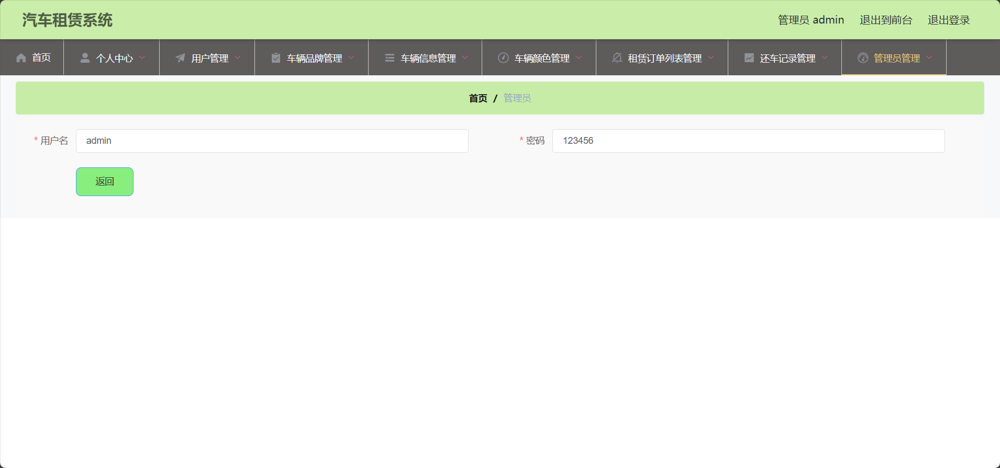
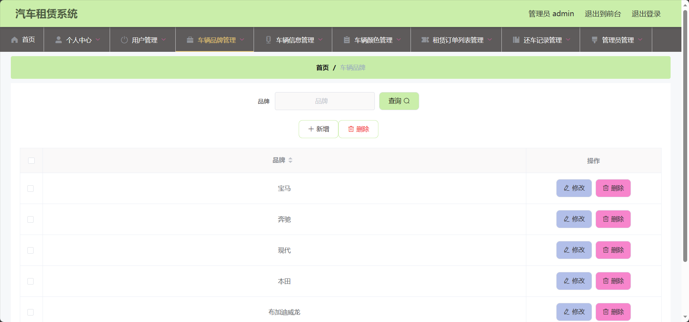
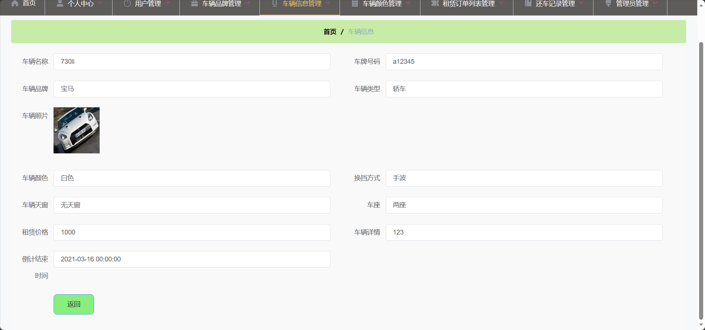
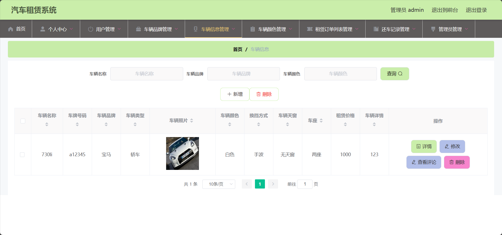
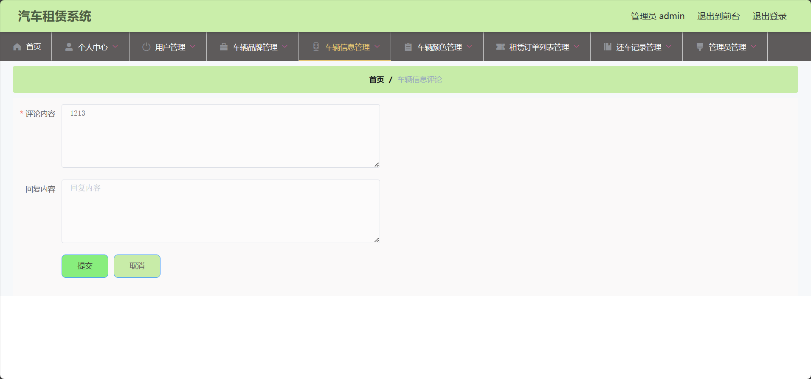
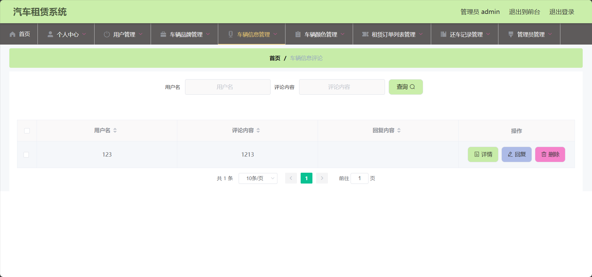

<h1 align="center">基于SSM框架的汽车租赁系统</h1>

 获取sql文件 QQ: 605739993 QQ群: 377586148 

 [个人站点: 从戎源码网](https://armycodes.com/)

## 简介

> 本代码来源于网络,仅供学习参考使用!
>
> 提供1.远程部署/2.修改代码/3.设计文档指导/4.框架代码讲解等服务
>
> 前端地址：http://localhost:8081/
>
> 管理员: admin 密码: 123456
>
> 用户：001 密码: 123456

## 项目介绍

基于SSM框架的汽车租赁系统：前端 ElementUI、LayUI、Vue，后端 SpringBoot、Mybatis-Plus，系统角色分为：管理员和用户，管理员在管理后台管理车辆信息，对车辆品牌进行管理，管理租赁订单等；用户根据发布的租车信息选择车辆租赁等。主要功能如下：

### 启动方式

- 前端：
> cd src/main/resources/admin/admin
>
> npm install
>
> npm run serve

- 后端：
> 按钮启动 | 右键run SpringbootSchemaApplication

### 管理员：

- 基本操作：登录、修改密码、获取个人信息
- 用户管理：新增用户、获取用户列表、筛选用户信息、查看用户信息详情、修改用户信息、删除用户
- 车辆品牌管理：新增品牌、筛选品牌、修改品牌信息、删除品牌
- 车辆信息管理：筛选车辆、获取车辆信息列表、查看车辆信息详情、修改车辆信息、删除车辆信息、查看车辆评论
- 车辆颜色管理：筛选车辆颜色、新增车辆颜色、修改车辆颜色、删除车辆颜色
- 租赁订单管理：筛选订单、删除订单、审核租赁请求、修改订单信息、查看订单信息详情
- 还车信息管理：筛选还车信息、上传还车信息、查看还车信息详情、修改还车信息、删除还车信息
- 管理员管理：新增管理员、搜索管理员、查看管理员信息详情、修改管理员信息、删除管理员

### 用户：

- 基本操作：登录、注册、修改个人信息、查看基本资料
- 车辆信息模块：获取车辆列表、筛选车辆、查看车辆信息详情、点赞、拉踩、评论车辆、租赁、收藏车辆
- 系统公告模块：获取系统公告列表、查看系统公告详情
- 其他操作：获取轮播图列表、查看收藏列表

## 环境

- <b>IntelliJ IDEA 2020.3</b>

- <b>Mysql 5.7.26</b>

- <b>NodeJs 14.17.3</b>

- <b>Maven 3.6.3</b>

- <b>JDK 1.8</b>

## 运行截图

